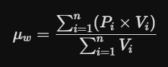
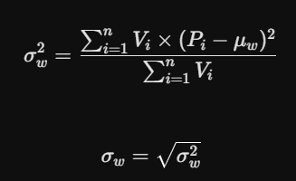
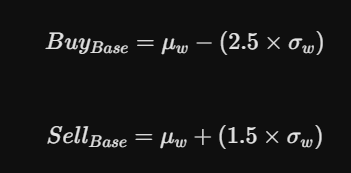
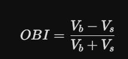
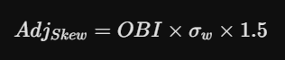
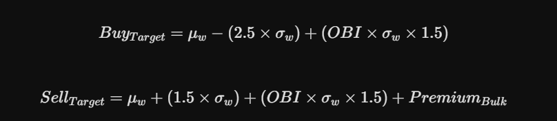

# The Idea
Pull PoE2 API data (every 60 mins) -> 

Do analysis on promising currencies (Math™) -> 

Send full analysis of top 5 to 10 currencies on Discord every few hours ->

Manually go do the trade (Automation is illegal)

## 3 strats to max my currency:

### 1. Volume-Weighted Asymmetric Mean Reversion

- We calculate the rolling mean and standard deviation over a dynamic timeframe, weighted based on trade volume to filter low-liquidity price fixing/markte manipulation.
- Place target buy order at bottom band (like 2.5 std dev) and sell order at top band (like 1.5 * std dev or something)
- Boom, profit

`Volume Weighted Mean`



Where `Pi` is the price at a given tick, `Vi` is the volume traded at that tick, and `n` is the time window.

`Volume-Weighted Variance & Std Dev`



`Base Asymetric Bands`



### 2. Order Book Imbalance (OBI)

- If we just keep them there we are naive (volatility is not the only variable, even in a simple market, dumbass)
- We look at the ratio of **buyers** vs **sellers** as well (The order book imbalance)
- If the market is heavily weighted with buyers (closer to 1), we shift our entire volatility bracket upward based on the ratio (but keep our buy quite low as we don't want to be paying that hype premium)
- If the market is heavily weighted with sellers (closer to -1), we shift our entire volatility bracket downward to get that cheap cheap, also based on the ratio

`OBI:`



Where `Vb` is the total volume of active buy orders and `Vs` is the total volume of active sell orders.

`The Skew Adjustment:`



(Where 1.5 is just a tuning constant)

```text
"But, like, what if something just keeps spiraling into oblivion?"

We just keep a max position size? duh?
```
### 3. Bulk Premium

- You kow what sucks? Buying 100 divine orbs here, and 50 there, and another 70 somewhere else. 
- So seeing as I'm making everyone's life easier; if I sell more than 500 at a time, you best believe I'm adding another 0.5 std devs

`Bulk Premium:`


### Final Formula (?):



## Disclaimer

This does not yet incorporate the gold fees (YET)